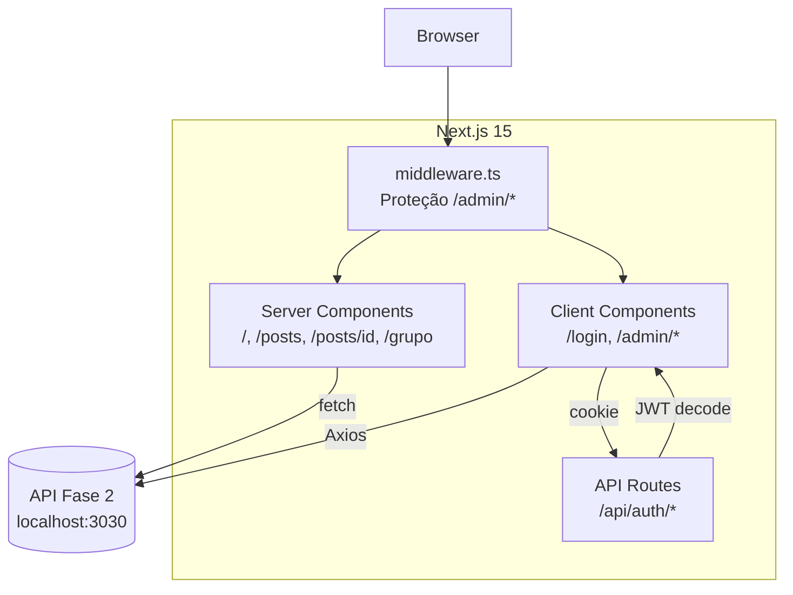
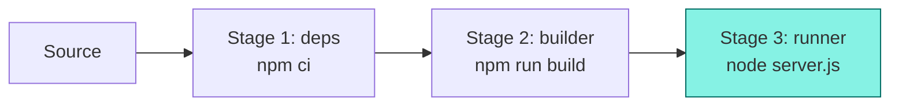
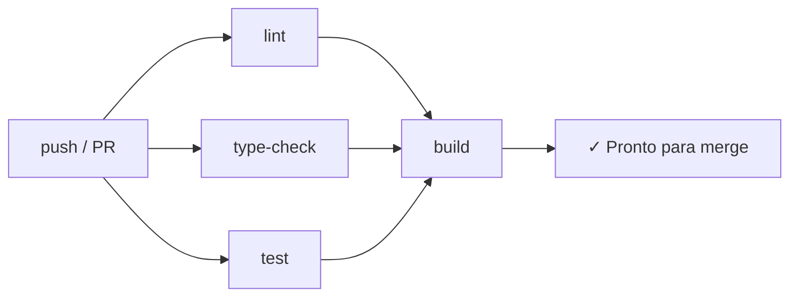
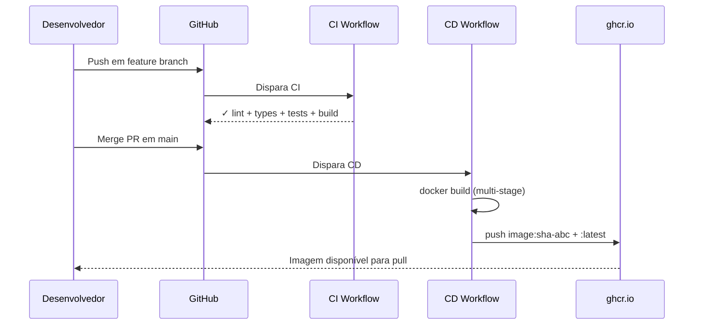

# Tech Challenge Fase 3 - Frontend de Blogging Educacional

<div align="center">

**Interface gráfica para a plataforma de conteúdo educacional**

[](#)
[](https://opensource.org/licenses/MIT)

[](https://nextjs.org/)
[](https://react.dev/)
[](https://www.typescriptlang.org/)
[](https://tailwindcss.com/)
[](https://vitest.dev/)

</div>

---

## 📋 Índice

1. [Sobre o Projeto](#-sobre-o-projeto)
2. [Tecnologias](#️-tecnologias)
3. [Arquitetura](#️-arquitetura)
4. [Páginas e Funcionalidades](#-páginas-e-funcionalidades)
5. [Fluxo de Autenticação](#-fluxo-de-autenticação)
6. [Design System](#-design-system)
7. [Testes](#-testes)
8. [Setup e Instalação](#-setup-e-instalação)
9. [Docker](#-docker)
10. [CI/CD](#️-cicd)
11. [Dificuldades Encontradas](#️-dificuldades-encontradas)
12. [Equipe](#-equipe)

---

## 🎯 Sobre o Projeto

Este projeto foi desenvolvido como parte do **Tech Challenge — Fase 3** do curso de **Full Stack Development** da FIAP (turma 8FSDT). A proposta consiste em construir a interface gráfica para a aplicação de blogging educacional cuja API RESTful foi implementada na Fase 2.

A aplicação atende dois perfis de usuário: **professores** (TEACHER), que gerenciam postagens pelo painel administrativo, e **alunos/visitantes** (STUDENT/guest), que consomem conteúdo publicado e podem interagir via comentários anônimos. O frontend foi desenvolvido com **Next.js 15 (App Router)**, utilizando renderização híbrida (Server e Client Components), estilização com **Tailwind CSS** e um Design System próprio ("The Academic Curator").

### Contexto

Professores da rede pública de educação carecem de plataformas onde possam publicar aulas e compartilhar conhecimento de forma prática, centralizada e tecnológica. A Fase 2 entregou a API backend em Node.js + PostgreSQL. A Fase 3 entrega o frontend que torna essa API acessível por meio de uma interface responsiva, acessível e intuitiva.

### Funcionalidades Principais

- **Lista de posts com busca**: Busca por palavra-chave e filtro por disciplina na página inicial
- **Leitura de posts com comentários**: Conteúdo completo do post com seção de comentários anônimos
- **Criação e edição de postagens**: Formulários com validação (apenas docentes autenticados)
- **Painel administrativo**: DataTable com listagem, edição e exclusão de posts
- **Autenticação passwordless**: Login por email com JWT armazenado em httpOnly cookie
- **Design System documentado**: Paleta de cores, tipografia, componentes e regras visuais

### Screenshots

| Home | Artigo |
|------|--------|
|  |  |

| Admin Dashboard | Editar Post | Login |
|-----------------|-------------|-------|
|  |  |  |

---

## 🛠️ Tecnologias

| Camada | Tecnologia | Origem |
|--------|-----------|--------|
| Framework | Next.js 15 (App Router) | Módulo 04 — ADR-01 |
| Linguagem | TypeScript | Módulo 02 Aula 01 |
| Estilização | Tailwind CSS | Módulo 04 Aula 02 — ADR-02 |
| Formulários | React Hook Form + Zod | ADR-03 (curso ensina Formik+Yup) |
| HTTP | Axios | Módulo 02 Aula 06 |
| Estado global | Context API | Módulo 03 Aula 03 |
| Testes | Vitest + React Testing Library | Módulo 03 Aula 05 |
| Auth | JWT em httpOnly cookie + middleware | ADR-04 |
| Container | Docker + Docker Compose | Requisito do challenge |
| CI/CD | GitHub Actions | Requisito do challenge |

### Hooks e Componentes Funcionais

Toda a aplicação utiliza **componentes funcionais** com hooks — não há class components. Os seguintes hooks são utilizados:

| Hook | Onde é usado | Para quê |
|------|-------------|----------|
| `useState` | AuthContext, PostForm, SearchBar, CommentSection, páginas admin e login | Gerenciamento de estado local |
| `useEffect` | AuthContext, PostForm, CommentSection, páginas admin e login | Side effects (fetch de dados, rehydrate de auth) |
| `useCallback` | AuthContext, CommentSection | Memoização de funções (login, logout, paginação) |
| `useContext` | useAuth (custom hook) | Acesso ao contexto de autenticação |
| `useRef` | PostForm | Referências DOM (selects de disciplina e status) |

**Custom hook:**
- `useAuth()` — encapsula `useContext(AuthContext)` com tratamento de erro, usado em todos os componentes que precisam do estado de autenticação

### Decisões Arquiteturais (ADRs)

Algumas escolhas tecnológicas divergem do conteúdo ensinado nas aulas. Cada divergência foi registrada como uma ADR (Architecture Decision Record) com a justificativa correspondente:

| ADR | Decisão | Motivo |
|-----|---------|--------|
| 01 | Next.js App Router em vez de React+Vite | Demonstra conteúdo do Módulo 04 (SSR, API Routes, BFF) |
| 02 | Tailwind CSS em vez de Styled Components | Integração nativa com App Router, sem runtime JS |
| 03 | React Hook Form + Zod em vez de Formik+Yup | Inferência TypeScript nativa, padrão de mercado atual |
| 04 | httpOnly cookie em vez de localStorage | Proteção contra XSS, sem flash de autenticação |
| 05 | Estrutura em camadas (services/, lib/, types/) | Espelha a arquitetura da API Fase 2 |
| 06 | Contract-first para comentários | Frontend definiu o contrato da API de comentários |
| 07 | UUID em localStorage para comentários anônimos | Ownership de comentários sem exigir login |

---

## 🏗️ Arquitetura

### Renderização Híbrida

A aplicação utiliza **renderização híbrida** conforme ensinado no Módulo 04 (Aulas 04 e Extra). Cada rota foi classificada como Server ou Client Component com base na sua necessidade de interatividade:

| Rota | Tipo | Justificativa |
|------|------|---------------|
| `/` | Server Component | SEO + performance para visitantes |
| `/posts/[id]` | Server Component | SEO + conteúdo indexável |
| `/login` | Client Component | Formulário interativo |
| `/admin` | Client Component | Lista mutável, ações inline |
| `/admin/posts/new` | Client Component | Formulário interativo |
| `/admin/posts/[id]/edit` | Client Component | Carrega dados + formulário |
| `/grupo` | Server Component | Estática, dados fixos |
| `/design-system` | Server Component | Estática, documentação |

### Diagrama de Arquitetura



### Estrutura de Pastas

```
src/
├── app/                    # Next.js App Router pages + API Routes
│   ├── api/auth/           # set-cookie, clear-cookie, me
│   ├── admin/              # Área protegida (Client Components)
│   ├── posts/              # Páginas públicas de posts (Server Components)
│   ├── login/              # Página de login (Client Component)
│   ├── grupo/              # Página do grupo
│   └── design-system/      # Documentação do Design System
├── components/
│   ├── layout/             # Header, Footer, Sidebar, AdminSidebar
│   ├── posts/              # PostCard, PostList, SearchBar
│   ├── comments/           # CommentSection, CommentForm, CommentItem
│   └── ui/                 # Button, Input, Badge, DataTable, etc.
├── contexts/               # AuthContext com hook useAuth
├── lib/
│   ├── api.ts              # Instância Axios + interceptors
│   ├── anonymous.ts        # UUID em localStorage
│   └── schemas/            # Schemas Zod (login, post, comment)
├── services/               # auth.service.ts, posts.service.ts, comments.service.ts
├── types/                  # Interfaces TypeScript (user, post, comment)
└── middleware.ts            # Proteção de rotas /admin/*
```

---

## 📄 Páginas e Funcionalidades

### Páginas Públicas

- **Home** (`/`): Página inicial com hero contendo campo de busca, lista de posts com filtro por disciplina e paginação. Os posts são renderizados como Server Component para otimizar SEO.

- **Artigo** (`/posts/[id]`): Exibe o conteúdo completo de um post com badges de status e disciplina. Inclui seção de comentários anônimos — cada visitante recebe um UUID em `localStorage` que permite identificar e deletar seus próprios comentários sem necessidade de login.

- **Grupo** (`/grupo`): Cards com os integrantes do Grupo 12 e seus respectivos RMs.

- **Design System** (`/design-system`): Documentação interativa do Design System "The Academic Curator" — paleta de cores, tipografia, elevação, componentes e regras visuais.

### Autenticação

- **Login** (`/login`): Formulário passwordless que solicita apenas o email do docente. Validação em tempo real com React Hook Form + Zod. Feedback visual de erro seguindo o Design System (fundo vermelho suave, nunca borda vermelha isolada).

### Área Administrativa (protegida)

Todas as rotas `/admin/*` são protegidas por `middleware.ts` — apenas usuários com role TEACHER e JWT válido em httpOnly cookie podem acessar.

- **Dashboard** (`/admin`): Painel com stats cards no topo (total de posts, publicados, rascunhos, arquivados) e DataTable com todos os posts. A tabela suporta filtro por texto e ações de editar/excluir por linha.

- **Novo Post** (`/admin/posts/new`): Formulário para criação de postagens com campos de título, conteúdo, disciplina e status. Validação com Zod — título mínimo de 5 caracteres, conteúdo mínimo de 10 caracteres.

- **Editar Post** (`/admin/posts/[id]/edit`): Mesmo formulário de criação, pré-populado com os dados do post existente. O campo de autor exibe o nome do criador original como informação não editável.

---

## 🔐 Fluxo de Autenticação

O frontend utiliza **JWT armazenado em httpOnly cookie** (ADR-04) em vez de `localStorage`. Essa escolha protege contra ataques XSS (JavaScript não consegue acessar o cookie) e elimina o "flash de autenticação" no refresh da página — o estado do usuário é reidratado server-side antes da renderização.

Três API Routes internas gerenciam o ciclo de vida do cookie:
- `POST /api/auth/set-cookie` — armazena o JWT após login
- `POST /api/auth/clear-cookie` — remove o cookie no logout
- `GET /api/auth/me` — decodifica o JWT server-side usando `JWT_SECRET` e retorna o objeto do usuário


---

## 🎨 Design System

O Design System **"The Academic Curator"** foi criado para transmitir seriedade acadêmica com leveza visual. Os tokens estão configurados em `tailwind.config.ts` e são usados consistentemente em toda a aplicação.

### Paleta de Cores

| Token | Hex | Uso |
|-------|-----|-----|
| `primary` | `#022448` | Headers, elementos de destaque |
| `primary-container` | `#1E3A5F` | Fundos de destaque |
| `secondary` | `#006A61` | Botões primários, links ativos |
| `secondary-container` | `#86F2E4` | Badges, destaques leves |
| `surface` | `#F9F9FF` | Fundo principal |
| `on-surface` | `#111C2D` | Texto (nunca preto puro) |
| `on-surface-variant` | `#94A3B8` | Texto secundário |
| `error` | `#DC2626` | Validação, estados de erro |

### Regras Visuais

- **Sem bordas para separação**: Layout usa shifts de background color em vez de `1px solid` para separar seções
- **Botão primário com gradiente**: `bg-gradient-to-r from-secondary to-secondary-on-container` — nunca cor sólida
- **Header com glassmorphism**: `bg-slate-50/80 backdrop-blur-md` para efeito de vidro fosco
- **Cards com sombra sutil**: `shadow-xl shadow-sky-950/5`
- **Inputs em erro**: `bg-error-container/20 border border-error/40` — única exceção à regra de no-border

### Ícones por Disciplina

Ícones do [Material Symbols](https://fonts.google.com/icons) mapeados por disciplina:

| Disciplina | Ícone |
|------------|-------|
| Matemática | `functions` |
| Português | `menu_book` |
| Ciências | `science` |
| História | `history_edu` |
| Geografia | `public` |

---

## 🧪 Testes

A aplicação utiliza **Vitest** + **React Testing Library** para testes, seguindo o padrão ensinado no Módulo 03 Aula 05. Os testes focam em **Client Components** — Server Components não são testáveis em ambiente jsdom. Chamadas HTTP são mockadas com `vi.mock('axios')`.

### Áreas Testadas

| Área | Arquivo de teste | O que testa |
|------|-----------------|-------------|
| AuthContext | `contexts/__tests__/AuthContext.test.tsx` | Login, logout, rehydrate do usuário |
| PostCard | `components/posts/__tests__/PostCard.test.tsx` | Renderização, badges, links |
| SearchBar | `components/posts/__tests__/SearchBar.test.tsx` | Busca, filtros por disciplina |
| PostForm | `__tests__/components/admin/PostForm.test.tsx` | Validação Zod, submissão |
| CommentForm | `__tests__/components/comments/CommentForm.test.tsx` | Criação de comentários |
| CommentItem | `__tests__/components/comments/CommentItem.test.tsx` | Renderização, deleção |
| DataTable | `components/ui/data-table/__tests__/DataTable.test.tsx` | Ordenação, filtro, paginação |
| Admin page | `__tests__/app/admin/AdminPage.test.tsx` | Listagem, ações de editar/excluir |
| Login page | `app/login/__tests__/LoginPage.test.tsx` | Formulário, validação, redirect |
| Schemas Zod | `lib/schemas/__tests__/*.test.ts` | Validação de login, post, comment |
| anonymous.ts | `lib/__tests__/anonymous.test.ts` | Geração/persistência UUID |
| UI components | `components/ui/__tests__/*.test.tsx` | Badge, Button, Input, ConfirmModal, IconCount |

### Como Rodar

```bash
npm run test          # Watch mode (desenvolvimento)
npm run test:run      # Execução única (CI)
npm run test:coverage # Com relatório de cobertura
```

---

## 🚀 Setup e Instalação

### Pré-requisitos

- **Node.js** 18+ ([Download](https://nodejs.org/))
- **npm** 9+ (incluído com Node.js)
- **API Fase 2** rodando em `http://localhost:3030` ([Repositório](https://github.com/natanjunior/8FSDT-tech-challenge-2))

### 1. Clonar o Repositório

```bash
git clone https://github.com/natanjunior/8FSDT-tech-challenge-3.git
cd 8FSDT-tech-challenge-3
```

### 2. Instalar Dependências

```bash
npm install
```

### 3. Configurar Variáveis de Ambiente

```bash
cp .env.example .env
```

Edite `.env` com suas configurações:

```env
NEXT_PUBLIC_API_URL=http://localhost:3030
JWT_SECRET=mesma_secret_da_api_fase_2
```

### 4. Iniciar Servidor de Desenvolvimento

```bash
npm run dev
```

Aplicação rodando em: `http://localhost:3000`

### Variáveis de Ambiente

| Variável | Descrição | Padrão | Obrigatória |
|----------|-----------|--------|-------------|
| `NEXT_PUBLIC_API_URL` | URL da API Fase 2 | `http://localhost:3030` | Sim |
| `JWT_SECRET` | Secret para decodificar JWT (mesmo da Fase 2) | — | Sim |

### Scripts Disponíveis

| Script | Descrição |
|--------|-----------|
| `npm run dev` | Servidor de desenvolvimento (localhost:3000) |
| `npm run build` | Build de produção |
| `npm run lint` | ESLint |
| `npm run test` | Testes em watch mode |
| `npm run test:run` | Testes em execução única (CI) |
| `npm run test:coverage` | Testes com relatório de cobertura |

---

## 🐳 Docker

A aplicação é containerizada com **Docker multi-stage build** para garantir uma imagem final mínima, segura e idêntica entre ambientes (desenvolvimento, CI e produção). A abordagem segue boas práticas oficiais do Next.js: separar a etapa de build (que precisa de devDependencies como TypeScript, Tailwind e tipos) da etapa de runtime, que utiliza o **output `standalone`** do Next.js — um servidor Node autocontido que dispensa `node_modules` completo na imagem final.

### Estratégia Multi-Stage

O [Dockerfile](Dockerfile) é dividido em três estágios. Apenas o último estágio compõe a imagem publicada; os demais são descartados.

| Estágio | Base | Responsabilidade |
|---------|------|------------------|
| `deps` | `node:20-alpine` | Instala todas as dependências (`npm ci`) — inclusive devDependencies, necessárias para o build do Next |
| `builder` | `node:20-alpine` | Copia `node_modules` do estágio anterior, copia o código-fonte e executa `npm run build` (gera `.next/standalone` e `.next/static`) |
| `runner` | `node:20-alpine` | Imagem final. Copia apenas `public/`, `.next/standalone` e `.next/static`. Cria usuário não-root `nextjs:nodejs` (UID 1001) e expõe a porta 3000 |



### Decisões de Segurança e Tamanho

- **Imagem `alpine`**: base mínima (~5 MB) que reduz superfície de ataque e tempo de pull
- **Usuário não-root**: o container roda como `nextjs` (UID 1001), nunca como root — boa prática contra container escape
- **Output `standalone`**: configurado em [next.config.ts](next.config.ts) — o Next gera um servidor com apenas as dependências de produção tree-shaken, reduzindo a imagem final em ~80% comparada a copiar `node_modules` inteiro
- **`.dockerignore`**: exclui `node_modules`, `.next`, `.git`, `docs/`, arquivos `.env` e o próprio `docker-compose.yml` do contexto de build, evitando vazamento de segredos e reduzindo o tempo de transferência

### docker-compose

O [docker-compose.yml](docker-compose.yml) orquestra o serviço de frontend e expõe variáveis de ambiente. Há um bloco comentado para conectar à rede externa criada pelo `docker-compose` da Fase 2, permitindo que o frontend resolva `backend:3030` em vez de `localhost:3030`.

```yaml
services:
  frontend:
    build: { context: ., dockerfile: Dockerfile }
    ports: ['3000:3000']
    environment:
      - NEXT_PUBLIC_API_URL=${NEXT_PUBLIC_API_URL:-http://localhost:3030}
      - JWT_SECRET=${JWT_SECRET}
```

### Comandos

```bash
# Build da imagem
docker build -t edublog-frontend .

# Run direto (após build)
docker run -p 3000:3000 \
  -e NEXT_PUBLIC_API_URL=http://host.docker.internal:3030 \
  -e JWT_SECRET=<mesma_secret_da_fase_2> \
  edublog-frontend

# Via docker-compose (lê .env automaticamente)
docker compose up -d
docker compose logs -f frontend
docker compose down
```

---

## ⚙️ CI/CD

O projeto utiliza **GitHub Actions** com pipelines separados para **integração contínua** (CI) e **entrega contínua** (CD). A separação garante que toda mudança seja validada antes de chegar à `main`, e que toda imagem publicada no registry tenha origem rastreável em um commit que passou nos checks.

### Pipeline de CI

Definido em [`.github/workflows/ci.yml`](.github/workflows/ci.yml). Executa em **push para qualquer branch** e em **pull requests para `main`**. Composto por 4 jobs:

| Job | Comando | Propósito |
|-----|---------|-----------|
| `lint` | `npm run lint` | ESLint — padronização de código |
| `type-check` | `npx tsc --noEmit` | Verifica tipagem sem gerar arquivos |
| `test` | `npx vitest run --reporter=verbose` | Executa toda a suite de testes |
| `build` | `npm run build` | Build de produção do Next.js |

O job `build` declara `needs: [lint, type-check, test]` — só executa se os três anteriores passarem. Os três jobs de validação rodam em **paralelo**, otimizando o tempo total do pipeline.



Todos os jobs utilizam **Node 20** com cache de `npm` via `actions/setup-node@v4`, reduzindo o tempo de instalação em runs subsequentes.

### Pipeline de CD

Definido em [`.github/workflows/cd.yml`](.github/workflows/cd.yml). Executa apenas em **push para `main`** (tipicamente após merge de PR validado pelo CI). Constrói a imagem Docker e publica no **GitHub Container Registry (GHCR)** em `ghcr.io/natanjunior/8fsdt-tech-challenge-3`.

A action `docker/metadata-action@v5` gera duas tags por imagem:
- `sha-<short_commit>` — identifica o commit exato (versionamento imutável)
- `latest` — sempre aponta para o último build de `main`



### Variáveis e Secrets

| Tipo | Nome | Uso |
|------|------|-----|
| Secret | `GITHUB_TOKEN` | Fornecido automaticamente pelo Actions; autoriza push no GHCR |
| Variable | `NEXT_PUBLIC_API_URL` | URL da API consumida em build-time (passada como `--build-arg`) |
| Secret (CI) | `JWT_SECRET` | Placeholder no CI (`ci-placeholder-secret`) — o build não precisa de uma secret real |

### Como Consumir a Imagem Publicada

```bash
# Pull da imagem mais recente
docker pull ghcr.io/natanjunior/8fsdt-tech-challenge-3:latest

# Pull de uma versão específica (por commit SHA)
docker pull ghcr.io/natanjunior/8fsdt-tech-challenge-3:sha-0a5ea69

# Run
docker run -p 3000:3000 \
  -e NEXT_PUBLIC_API_URL=<url_da_api> \
  -e JWT_SECRET=<secret> \
  ghcr.io/natanjunior/8fsdt-tech-challenge-3:latest
```

> A imagem é pública (visibilidade do pacote configurada no GHCR), portanto não exige autenticação para `pull`.

---

## ⚠️ Dificuldades Encontradas

<!-- TODO: preencher com desafios enfrentados durante o desenvolvimento -->

---

## 👥 Equipe

**Grupo 12**

- **Dario Lacerda** - rm369195
- **Larissa Kramer** - rm370062
- **Mirian Storino** - rm369489
- **Natanael Dias** - rm369334
- **Tiago Victor** - rm370117

---

## 📄 Licença

MIT License - Projeto Educacional
