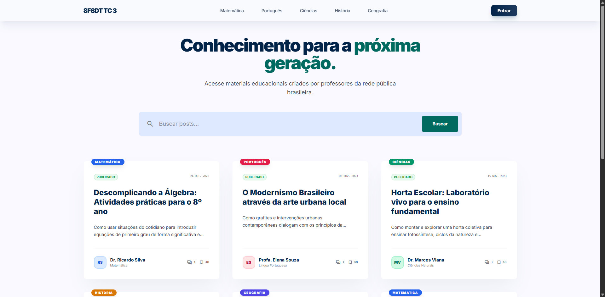
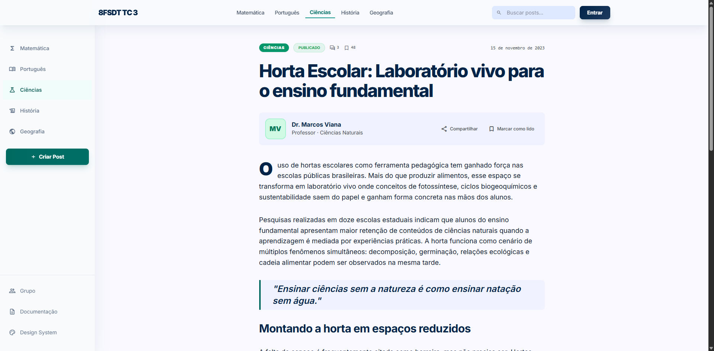
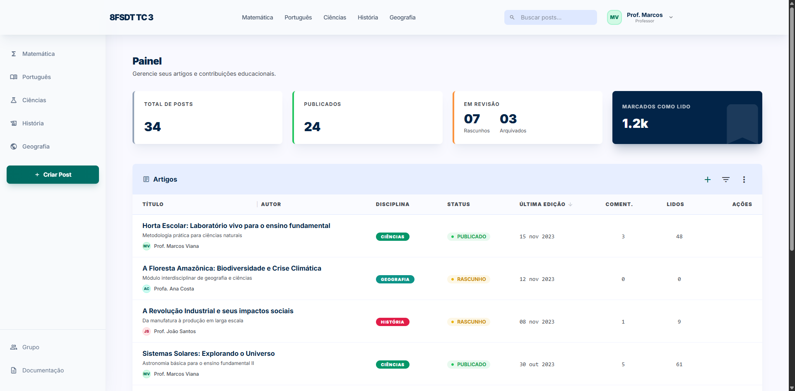
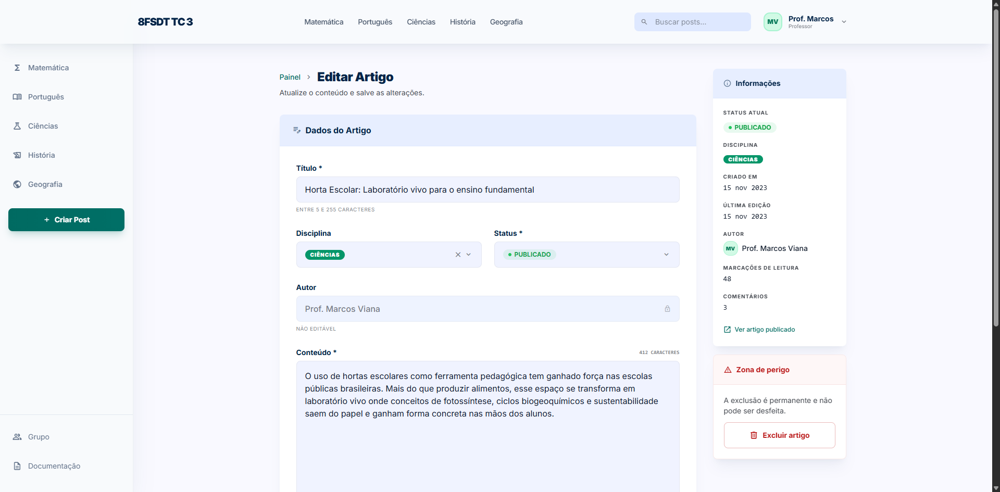
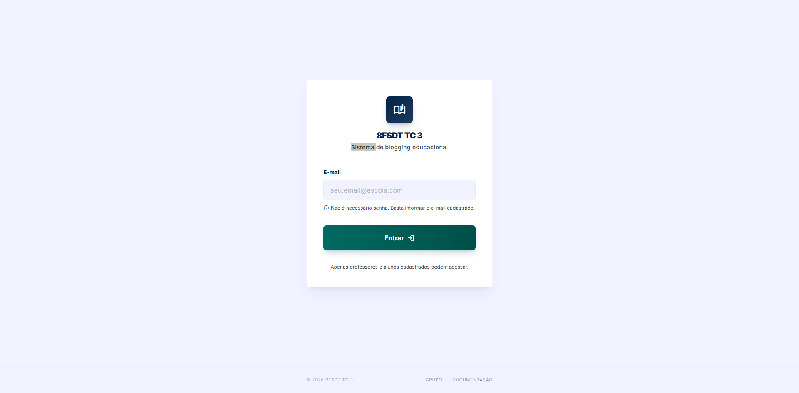
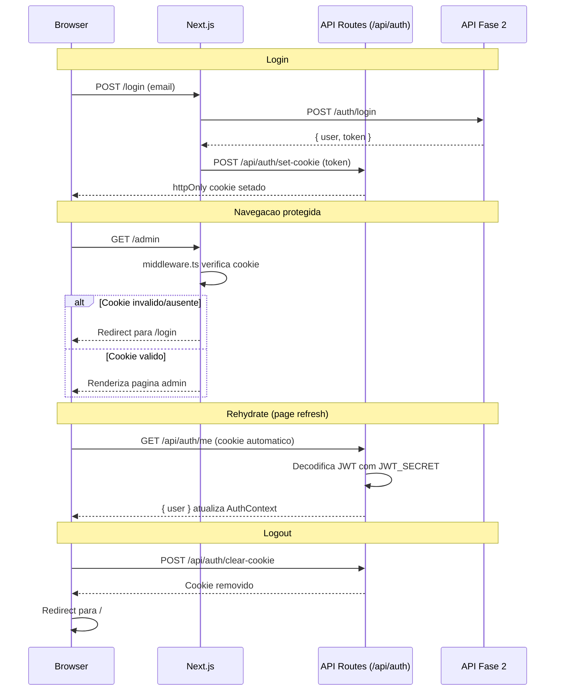

# Tech Challenge Fase 3 - Frontend de Blogging Educacional

<div align="center">

**Interface grafica para a plataforma de conteudo educacional**

[](#)
[](https://opensource.org/licenses/MIT)

[](https://nextjs.org/)
[](https://react.dev/)
[](https://www.typescriptlang.org/)
[](https://tailwindcss.com/)
[](https://vitest.dev/)

</div>

---

## 📋 Indice

1. [Sobre o Projeto](#-sobre-o-projeto)
2. [Tecnologias](#️-tecnologias)
3. [Arquitetura](#️-arquitetura)
4. [Paginas e Funcionalidades](#-paginas-e-funcionalidades)
5. [Fluxo de Autenticacao](#-fluxo-de-autenticacao)
6. [Design System](#-design-system)
7. [Testes](#-testes)
8. [Setup e Instalacao](#-setup-e-instalacao)
9. [Docker](#-docker)
10. [CI/CD](#️-cicd)
11. [Dificuldades Encontradas](#️-dificuldades-encontradas)
12. [Equipe](#-equipe)

---

## 🎯 Sobre o Projeto

Este projeto foi desenvolvido como parte do **Tech Challenge — Fase 3** do curso de **Full Stack Development** da FIAP (turma 8FSDT). A proposta consiste em construir a interface grafica para a aplicacao de blogging educacional cuja API RESTful foi implementada na Fase 2.

A aplicacao atende dois perfis de usuario: **professores** (TEACHER), que gerenciam postagens pelo painel administrativo, e **alunos/visitantes** (STUDENT/guest), que consomem conteudo publicado e podem interagir via comentarios anonimos. O frontend foi desenvolvido com **Next.js 15 (App Router)**, utilizando renderizacao hibrida (Server e Client Components), estilizacao com **Tailwind CSS** e um Design System proprio ("The Academic Curator").

### Contexto

Professores da rede publica de educacao carecem de plataformas onde possam publicar aulas e compartilhar conhecimento de forma pratica, centralizada e tecnologica. A Fase 2 entregou a API backend em Node.js + PostgreSQL. A Fase 3 entrega o frontend que torna essa API acessivel por meio de uma interface responsiva, acessivel e intuitiva.

### Funcionalidades Principais

- **Lista de posts com busca**: Busca por palavra-chave e filtro por disciplina na pagina inicial
- **Leitura de posts com comentarios**: Conteudo completo do post com secao de comentarios anonimos
- **Criacao e edicao de postagens**: Formularios com validacao (apenas docentes autenticados)
- **Painel administrativo**: DataTable com listagem, edicao e exclusao de posts
- **Autenticacao passwordless**: Login por email com JWT armazenado em httpOnly cookie
- **Design System documentado**: Paleta de cores, tipografia, componentes e regras visuais

### Screenshots

| Home | Artigo |
|------|--------|
|  |  |

| Admin Dashboard | Editar Post | Login |
|-----------------|-------------|-------|
|  |  |  |

---

## 🛠️ Tecnologias

| Camada | Tecnologia | Origem |
|--------|-----------|--------|
| Framework | Next.js 15 (App Router) | Modulo 04 — ADR-01 |
| Linguagem | TypeScript | Modulo 02 Aula 01 |
| Estilizacao | Tailwind CSS | Modulo 04 Aula 02 — ADR-02 |
| Formularios | React Hook Form + Zod | ADR-03 (curso ensina Formik+Yup) |
| HTTP | Axios | Modulo 02 Aula 06 |
| Estado global | Context API | Modulo 03 Aula 03 |
| Testes | Vitest + React Testing Library | Modulo 03 Aula 05 |
| Auth | JWT em httpOnly cookie + middleware | ADR-04 |
| Container | Docker + Docker Compose | Requisito do challenge |
| CI/CD | GitHub Actions | Requisito do challenge |

### Decisoes Arquiteturais (ADRs)

Algumas escolhas tecnologicas divergem do conteudo ensinado nas aulas. Cada divergencia foi registrada como uma ADR (Architecture Decision Record) com a justificativa correspondente:

| ADR | Decisao | Motivo |
|-----|---------|--------|
| 01 | Next.js App Router em vez de React+Vite | Demonstra conteudo do Modulo 04 (SSR, API Routes, BFF) |
| 02 | Tailwind CSS em vez de Styled Components | Integracao nativa com App Router, sem runtime JS |
| 03 | React Hook Form + Zod em vez de Formik+Yup | Inferencia TypeScript nativa, padrao de mercado atual |
| 04 | httpOnly cookie em vez de localStorage | Protecao contra XSS, sem flash de autenticacao |
| 05 | Estrutura em camadas (services/, lib/, types/) | Espelha a arquitetura da API Fase 2 |
| 06 | Contract-first para comentarios | Frontend definiu o contrato da API de comentarios |
| 07 | UUID em localStorage para comentarios anonimos | Ownership de comentarios sem exigir login |

---

## 🏗️ Arquitetura

### Renderizacao Hibrida

A aplicacao utiliza **renderizacao hibrida** conforme ensinado no Modulo 04 (Aulas 04 e Extra). Cada rota foi classificada como Server ou Client Component com base na sua necessidade de interatividade:

| Rota | Tipo | Justificativa |
|------|------|---------------|
| `/` | Server Component | SEO + performance para visitantes |
| `/posts/[id]` | Server Component | SEO + conteudo indexavel |
| `/login` | Client Component | Formulario interativo |
| `/admin` | Client Component | Lista mutavel, acoes inline |
| `/admin/posts/new` | Client Component | Formulario interativo |
| `/admin/posts/[id]/edit` | Client Component | Carrega dados + formulario |
| `/grupo` | Server Component | Estatica, dados fixos |
| `/design-system` | Server Component | Estatica, documentacao |

### Diagrama de Arquitetura


### Estrutura de Pastas

```
src/
├── app/                    # Next.js App Router pages + API Routes
│   ├── api/auth/           # set-cookie, clear-cookie, me
│   ├── admin/              # Area protegida (Client Components)
│   ├── posts/              # Paginas publicas de posts (Server Components)
│   ├── login/              # Pagina de login (Client Component)
│   ├── grupo/              # Pagina do grupo
│   └── design-system/      # Documentacao do Design System
├── components/
│   ├── layout/             # Header, Footer, Sidebar, AdminSidebar
│   ├── posts/              # PostCard, PostList, SearchBar
│   ├── comments/           # CommentSection, CommentForm, CommentItem
│   └── ui/                 # Button, Input, Badge, DataTable, etc.
├── contexts/               # AuthContext com hook useAuth
├── lib/
│   ├── api.ts              # Instancia Axios + interceptors
│   ├── anonymous.ts        # UUID em localStorage
│   └── schemas/            # Schemas Zod (login, post, comment)
├── services/               # auth.service.ts, posts.service.ts, comments.service.ts
├── types/                  # Interfaces TypeScript (user, post, comment)
└── middleware.ts            # Protecao de rotas /admin/*
```

---

## 📄 Paginas e Funcionalidades

### Paginas Publicas

- **Home** (`/`): Pagina inicial com hero contendo campo de busca, lista de posts com filtro por disciplina e paginacao. Os posts sao renderizados como Server Component para otimizar SEO.

- **Artigo** (`/posts/[id]`): Exibe o conteudo completo de um post com badges de status e disciplina. Inclui secao de comentarios anonimos — cada visitante recebe um UUID em `localStorage` que permite identificar e deletar seus proprios comentarios sem necessidade de login.

- **Grupo** (`/grupo`): Cards com os integrantes do Grupo 12 e seus respectivos RMs.

- **Design System** (`/design-system`): Documentacao interativa do Design System "The Academic Curator" — paleta de cores, tipografia, elevacao, componentes e regras visuais.

### Autenticacao

- **Login** (`/login`): Formulario passwordless que solicita apenas o email do docente. Validacao em tempo real com React Hook Form + Zod. Feedback visual de erro seguindo o Design System (fundo vermelho suave, nunca borda vermelha isolada).

### Area Administrativa (protegida)

Todas as rotas `/admin/*` sao protegidas por `middleware.ts` — apenas usuarios com role TEACHER e JWT valido em httpOnly cookie podem acessar.

- **Dashboard** (`/admin`): Painel com stats cards no topo (total de posts, publicados, rascunhos, arquivados) e DataTable com todos os posts. A tabela suporta filtro por texto e acoes de editar/excluir por linha.

- **Novo Post** (`/admin/posts/new`): Formulario para criacao de postagens com campos de titulo, conteudo, disciplina e status. Validacao com Zod — titulo minimo de 5 caracteres, conteudo minimo de 10 caracteres.

- **Editar Post** (`/admin/posts/[id]/edit`): Mesmo formulario de criacao, pre-populado com os dados do post existente. O campo de autor exibe o nome do criador original como informacao nao editavel.

---

## 🔐 Fluxo de Autenticacao

O frontend utiliza **JWT armazenado em httpOnly cookie** (ADR-04) em vez de `localStorage`. Essa escolha protege contra ataques XSS (JavaScript nao consegue acessar o cookie) e elimina o "flash de autenticacao" no refresh da pagina — o estado do usuario e reidratado server-side antes da renderizacao.

Tres API Routes internas gerenciam o ciclo de vida do cookie:
- `POST /api/auth/set-cookie` — armazena o JWT apos login
- `POST /api/auth/clear-cookie` — remove o cookie no logout
- `GET /api/auth/me` — decodifica o JWT server-side usando `JWT_SECRET` e retorna o objeto do usuario



---

## 🎨 Design System

O Design System **"The Academic Curator"** foi criado para transmitir seriedade academica com leveza visual. Os tokens estao configurados em `tailwind.config.ts` e sao usados consistentemente em toda a aplicacao.

### Paleta de Cores

| Token | Hex | Uso |
|-------|-----|-----|
| `primary` | `#022448` | Headers, elementos de destaque |
| `primary-container` | `#1E3A5F` | Fundos de destaque |
| `secondary` | `#006A61` | Botoes primarios, links ativos |
| `secondary-container` | `#86F2E4` | Badges, destaques leves |
| `surface` | `#F9F9FF` | Fundo principal |
| `on-surface` | `#111C2D` | Texto (nunca preto puro) |
| `on-surface-variant` | `#94A3B8` | Texto secundario |
| `error` | `#DC2626` | Validacao, estados de erro |

### Regras Visuais

- **Sem bordas para separacao**: Layout usa shifts de background color em vez de `1px solid` para separar secoes
- **Botao primario com gradiente**: `bg-gradient-to-r from-secondary to-secondary-on-container` — nunca cor solida
- **Header com glassmorphism**: `bg-slate-50/80 backdrop-blur-md` para efeito de vidro fosco
- **Cards com sombra sutil**: `shadow-xl shadow-sky-950/5`
- **Inputs em erro**: `bg-error-container/20 border border-error/40` — unica excecao a regra de no-border

### Icones por Disciplina

Icones do [Material Symbols](https://fonts.google.com/icons) mapeados por disciplina:

| Disciplina | Icone |
|------------|-------|
| Matematica | `functions` |
| Portugues | `menu_book` |
| Ciencias | `science` |
| Historia | `history_edu` |
| Geografia | `public` |

---

## 🧪 Testes

A aplicacao utiliza **Vitest** + **React Testing Library** para testes, seguindo o padrao ensinado no Modulo 03 Aula 05. Os testes focam em **Client Components** — Server Components nao sao testaveis em ambiente jsdom. Chamadas HTTP sao mockadas com `vi.mock('axios')`.

### Areas Testadas

| Area | Arquivo de teste | O que testa |
|------|-----------------|-------------|
| AuthContext | `contexts/__tests__/AuthContext.test.tsx` | Login, logout, rehydrate do usuario |
| PostCard | `components/posts/__tests__/PostCard.test.tsx` | Renderizacao, badges, links |
| SearchBar | `components/posts/__tests__/SearchBar.test.tsx` | Busca, filtros por disciplina |
| PostForm | `__tests__/components/admin/PostForm.test.tsx` | Validacao Zod, submissao |
| CommentForm | `__tests__/components/comments/CommentForm.test.tsx` | Criacao de comentarios |
| CommentItem | `__tests__/components/comments/CommentItem.test.tsx` | Renderizacao, delecao |
| DataTable | `components/ui/data-table/__tests__/DataTable.test.tsx` | Ordenacao, filtro, paginacao |
| Admin page | `__tests__/app/admin/AdminPage.test.tsx` | Listagem, acoes de editar/excluir |
| Login page | `app/login/__tests__/LoginPage.test.tsx` | Formulario, validacao, redirect |
| Schemas Zod | `lib/schemas/__tests__/*.test.ts` | Validacao de login, post, comment |
| anonymous.ts | `lib/__tests__/anonymous.test.ts` | Geracao/persistencia UUID |
| UI components | `components/ui/__tests__/*.test.tsx` | Badge, Button, Input, ConfirmModal, IconCount |

### Como Rodar

```bash
npm run test          # Watch mode (desenvolvimento)
npm run test:run      # Execucao unica (CI)
npm run test:coverage # Com relatorio de cobertura
```

---

## 🚀 Setup e Instalacao

### Pre-requisitos

- **Node.js** 18+ ([Download](https://nodejs.org/))
- **npm** 9+ (incluido com Node.js)
- **API Fase 2** rodando em `http://localhost:3030` ([Repositorio](https://github.com/natanjunior/8FSDT-tech-challenge-2))

### 1. Clonar o Repositorio

```bash
git clone https://github.com/natanjunior/8FSDT-tech-challenge-3.git
cd 8FSDT-tech-challenge-3
```

### 2. Instalar Dependencias

```bash
npm install
```

### 3. Configurar Variaveis de Ambiente

```bash
cp .env.example .env
```

Edite `.env` com suas configuracoes:

```env
NEXT_PUBLIC_API_URL=http://localhost:3030
JWT_SECRET=mesma_secret_da_api_fase_2
```

### 4. Iniciar Servidor de Desenvolvimento

```bash
npm run dev
```

Aplicacao rodando em: `http://localhost:3000`

### Variaveis de Ambiente

| Variavel | Descricao | Padrao | Obrigatoria |
|----------|-----------|--------|-------------|
| `NEXT_PUBLIC_API_URL` | URL da API Fase 2 | `http://localhost:3030` | Sim |
| `JWT_SECRET` | Secret para decodificar JWT (mesmo da Fase 2) | — | Sim |

### Scripts Disponiveis

| Script | Descricao |
|--------|-----------|
| `npm run dev` | Servidor de desenvolvimento (localhost:3000) |
| `npm run build` | Build de producao |
| `npm run lint` | ESLint |
| `npm run test` | Testes em watch mode |
| `npm run test:run` | Testes em execucao unica (CI) |
| `npm run test:coverage` | Testes com relatorio de cobertura |

---

## 🐳 Docker

<!-- TODO: documentar Dockerfile, docker-compose e comandos -->

---

## ⚙️ CI/CD

<!-- TODO: documentar pipeline GitHub Actions e deploy Vercel -->

---

## ⚠️ Dificuldades Encontradas

<!-- TODO: preencher com desafios enfrentados durante o desenvolvimento -->

---

## 👥 Equipe

**Grupo 12**

- **Dario Lacerda** - rm369195
- **Larissa Kramer** - rm370062
- **Mirian Storino** - rm369489
- **Natanael Dias** - rm369334
- **Tiago Victor** - rm370117

---

## 📄 Licenca

MIT License - Projeto Educacional
